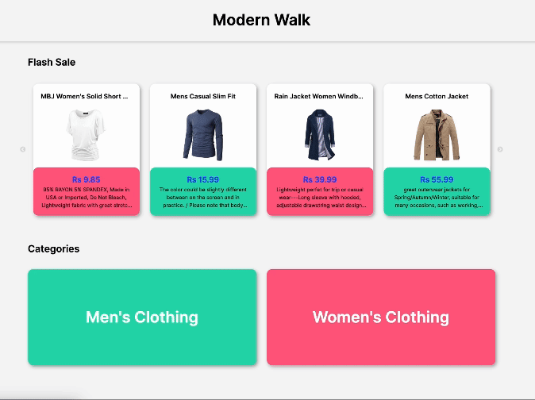

# Modern Walk

#### Modern Walk is a fashion retail web app

This is a quick prototype before moving to the
development phase. Created for WireApps.

|           Overview           |
| :--------------------------: |
|  |

## Technologies used

- Next.js
- Typescript
- Tailwind

## Getting Started

This is a [Next.js](https://nextjs.org/) project bootstrapped with [`create-next-app`](https://github.com/vercel/next.js/tree/canary/packages/create-next-app).

```bash
npm run dev
# or
yarn dev
# or
pnpm dev
# or
bun dev
```

Open [http://localhost:3000](http://localhost:3000) with your browser to see the result.
